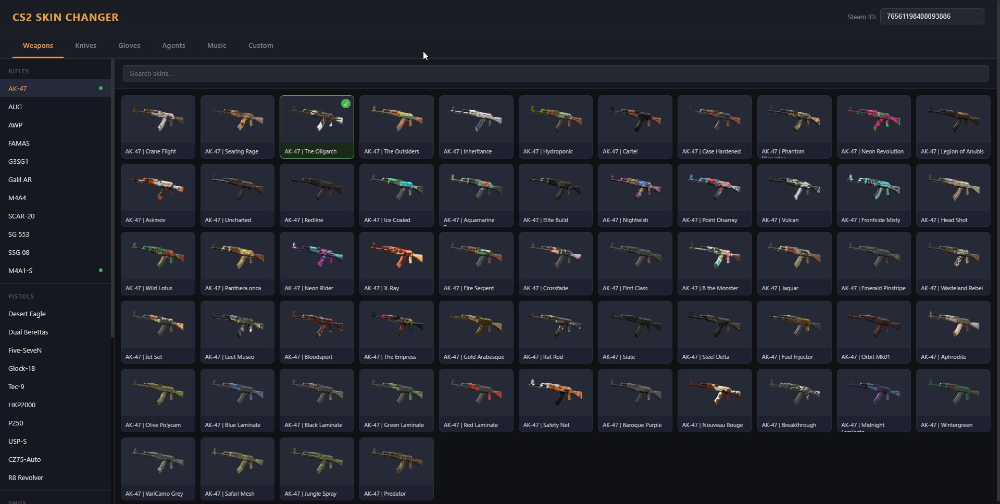

# cs2-armory-web

Web UI for the [Armory](https://github.com/Noldez/cs2-armory) CS2 cosmetics plugin.
Weapon skins, knives, gloves, agents, music kits, custom weapon models and per-team
player models — with **instant in-game sync**: every save is pushed to the running
game server through Armory's refresh listener, no in-game command needed.



## Setup

```bash
npm install
cp .env.example .env   # fill in DB credentials + Armory listener token
npm start              # http://localhost:3000
```

`.env`:

| Key | Meaning |
|-----|---------|
| `DB_*` | MySQL connection — same `armory` database the plugin uses |
| `ARMORY_URL` | plugin refresh listener, default `http://127.0.0.1:27021` |
| `ARMORY_TOKEN` | must match `Listener:Token` in `sharp/configs/armory.jsonc` |

The skin catalog is fetched once from public CS2 data sources and cached in `catalog.json`.

## How sync works

Every write endpoint upserts the `armory` database, then calls the plugin:

- `POST {ARMORY_URL}/refresh/{steamid}` — the player's inventory reloads immediately
- `POST {ARMORY_URL}/precache/reload` — after custom/player model changes (new models
  precache on the next map load)

If the game server is offline the push silently no-ops — changes still load on next connect.

## 3D previews

- Custom-skin cards with a `model3d` entry get a **3D** button (orbitable `<model-viewer>` modal).
- The Weapons/Knives tabs get a **View 3D** button for the selected weapon. The GLBs are
  extracted from your CS2 install (not committed — ~50 files, hundreds of MB):

  ```powershell
  powershell -File tools\extract-weapon-models.ps1   # needs Source 2 Viewer CLI
  ```

  Output lands in `public/models/weapons/<defindex>.glb` + `manifest.json`; the UI picks
  them up automatically on next load.

## Custom content

- `custom_skins.json` — custom weapon model entries shown in the Custom tab
- Player models catalog is defined in `server.js` (`PLAYER_MODELS_CATALOG`); models must
  meet the requirements in the plugin's `docs/custom-player-models.md`
